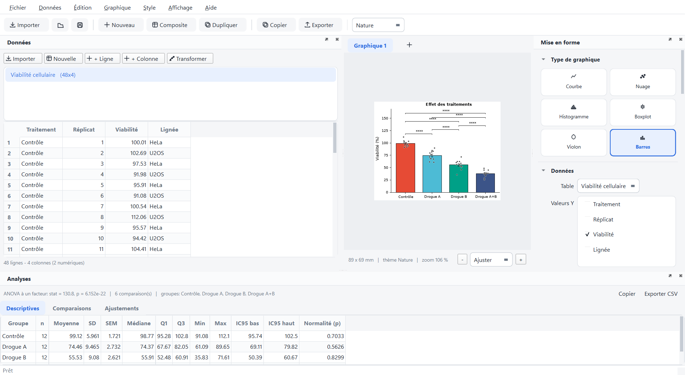
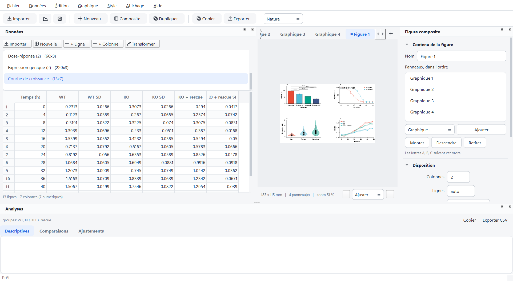

# Plotea

[Français](README.md) · **English**

[](https://github.com/Pierokarei/Plotea/actions/workflows/tests.yml)

Publication-quality scientific figures, free and open source: an open
alternative to GraphPad Prism. PyQt6 interface, matplotlib engine, SciPy
statistics.

The test suite runs on every commit on **Linux, macOS and Windows**, with
Python 3.11 and 3.13. Every release ships a standalone application for all
three systems, built and tested automatically; so far, only the Windows one
has been run on a real machine.





### Language / Langue

The interface is available in **French** and **English**. On first launch,
Plotea follows the system language (French on a French system, English
otherwise). You can change it at any time under **View → Langue / Language**.

Translations are plain JSON files in `plotea/locales`, keyed by the French
text, so adding a language takes no Python code at all.
`python tools/i18n_keys.py` lists what is missing, and the test suite rejects
any interface text that has no translation.

---

## What Plotea does

| | |
|---|---|
| **Import** | CSV, TSV, TXT (separator and decimal mark detected), multi-sheet Excel `.xlsx` / `.xlsm` / `.xls`, paste from Excel, **GraphPad Prism `.pzfx` files** |
| **Plot types** | line, scatter, histogram, box plot, violin plot, bars with error bars (simple, and grouped with two factors), **Kaplan-Meier survival curves**, **contingency tables** (bars stacked in percentages or counts) |
| **Themes** | Nature, Science, Cell, PNAS, Minimal, Grayscale: typography, column width and palette that follow each journal's author guidelines |
| **Export** | SVG, PDF, EPS (vector, editable text) · PNG, TIFF, JPEG up to 1200 dpi (600 dpi by default) |
| **Statistics** | Student's / Welch's / paired t-test, Mann-Whitney, Wilcoxon, ANOVA + Tukey, Kruskal-Wallis, **Dunnett vs control**, **repeated-measures ANOVA** (with Greenhouse-Geisser correction), **log-rank** on survival curves, **Fisher's exact test and chi-square** (with or without Yates' correction) on contingency tables, with odds ratio, relative risk and Cramér's V; Bonferroni / Holm / FDR corrections; **outlier detection (Grubbs)**; automatic significance bars, including on bars grouped by two factors |
| **Fits** | linear, polynomial, exponential, logarithmic, power, Michaelis-Menten, Hill 4PL (dose-response), Gaussian, sigmoid, with R², standard errors and a 95 % confidence band; **curve comparison** with Prism's F test ("does A's EC50 differ from B's?", or one curve for all series) |
| **Composite figures** | several plots on one figure, grid of your choice, automatic A/B/C lettering, shared axes |
| **Transforms** | percent of control, 0-100 normalization, log10 / ln / log2, z-score, baseline subtraction, ratio to a column, mean of replicates |
| **Projects** | `.plotea` files holding data, plots and composite figures; undo/redo, reusable styles, batch export, **backup copy every two minutes** with recovery after a crash, recent projects list |

### Beyond Prism

- **Free, no license key**: MIT-licensed code, nothing to activate.
- **Automatic test choice**: Shapiro for normality and Levene for equal
  variances, with the option to force a given test.
- **95 % confidence band** on nonlinear fits, computed with the delta
  method.
- **Preview at true physical size**: the figure is shown in millimetres, at
  the column width of the target journal.
- **SVG/PDF with editable text** (`svg.fonttype: none`, `pdf.fonttype: 42`):
  labels stay editable in Illustrator or Inkscape.
- **Group names that never overlap**: too long for the room they have,
  they break between words, or slant at 45° when a single word does not
  fit. A rotation chosen by hand always wins.
- **Monochrome mode** (hatching and a grey palette) for black-and-white
  printing.
- **Dark theme** for the interface; the figure itself always stays on a white
  background.
- **French or English interface**, down to Qt's standard dialogs: the closing
  prompt offers "Save / Quit without saving / Cancel" in English, and
  "Enregistrer / Quitter sans enregistrer / Annuler" in French.
- **One statistical test per figure**: assumptions are checked once across
  all groups rather than case by case, so Student's t and Mann-Whitney never
  end up mixed in the same legend.
- **Undo / redo** on data as well as formatting, with quick successive edits
  merged into a single step.
- **Large datasets**: beyond a few thousand points, series are rasterized in
  vector output and the overlay of individual points is capped on screen.
  The statistics always use every value. A 120,000-point scatter plot renders
  in 0.2 s.
- **Error log** you can read (**Help ▸ Error log**): whatever the engine
  catches to keep the window open is kept there with its full traceback, and
  written to a file you can attach to a bug report.
- **The session is remembered**: window size, panel layout, light or dark
  theme and the last folder used come back on the next launch.
  **View ▸ Reset layout** recovers a lost panel.

---

## Installation

### Standalone application (recommended)

No Python to install: download the archive for your system from the
[releases page](https://github.com/Pierokarei/Plotea/releases/latest), unzip
it and run `Plotea`. Everything is included: the interpreter, Qt and the
scientific stack.

| System | Archive | On first launch |
|---|---|---|
| Windows 10 / 11 | `Plotea-<version>-windows.zip` | **Extract All**, then run `Plotea\Plotea.exe`. At "Windows protected your PC": **More info → Run anyway**. |
| macOS (Apple M1 chips and later) | `Plotea-<version>-macos.zip` | Drag `Plotea.app` into Applications. When macOS refuses: **System Settings → Privacy & Security → Open Anyway** (right-click → **Open** on macOS 14 or earlier). |
| Linux (Ubuntu 24.04 or newer) | `Plotea-<version>-linux.tar.gz` | `tar xzf` the archive, then run `./Plotea/Plotea`. |

These warnings appear because Plotea is not signed with a paid certificate;
they do not come back afterwards. Each release page details the steps.
Intel Macs install Plotea from source.

To build the application yourself:

```bash
pip install pyinstaller
python tools/build_app.py             # the dist/Plotea folder
python tools/build_app.py --archive   # plus the archive to hand out
```

The result is in `dist/`: a `Plotea` folder on Windows and Linux, a
`Plotea.app` on macOS. On Linux, a `plotea.desktop` file is written as well;
install it with
`desktop-file-install --dir=~/.local/share/applications dist/plotea.desktop`.

The [plotea.spec](plotea.spec) file drives the build. It leaves out unused Qt
modules (WebEngine, QML, Multimedia…), which roughly halves the size of the
package.

### From source

Python 3.10 or later is required.

```bash
git clone <your-repository> plotea
cd plotea
python -m venv .venv
```

Activate the environment:

```bash
source .venv/bin/activate
```

```powershell
.venv\Scripts\Activate.ps1
```

Then install and run:

```bash
pip install -e .
plotea
```

Without installing, from the project folder:

```bash
pip install -r requirements.txt
python -m plotea
```

### Notes per system

- **Linux**: also install Qt's system libraries if they are missing:
  `sudo apt install libxcb-cursor0 libxkbcommon-x11-0` (Debian / Ubuntu).
  Helvetica and Arial are replaced automatically by Nimbus Sans or Liberation
  Sans; for output identical to the journals', install `fonts-liberation`.
- **macOS**: nothing special. Helvetica only ships as a system font
  collection (`.ttc`), which matplotlib does not read reliably: Plotea uses
  Arial, whose metrics are identical.
- **Windows**: Arial is used in place of Helvetica (identical metrics).
  **Avoid very long paths**: Qt's DLLs fail to load beyond the Windows path
  limit. Put the virtual environment in a short path, for example
  `C:\venvs\plotea`.

---

## Getting started

1. **File ▸ Example datasets** loads a dataset ready to plot, or
   **Import data** (`Ctrl+O`) opens a CSV/Excel file with a preview.
2. In the **Formatting** panel on the right, choose the plot type, then the
   X-axis column, the Y value columns and, optionally, a grouping column.
3. Choose the journal **theme** in the toolbar.
4. Turn on **Statistics ▸ Comparisons and annotations** to get the tests and
   the significance bars.
5. **Export the figure**: the **Copy** (PNG to the clipboard) and **Export**
   buttons are in the main toolbar. SVG or PDF for a submission, PNG 600 dpi
   for a document. Shortcuts `Ctrl+E` and `Ctrl+Shift+C`.

### Two data layouts

**Long format** (recommended): one column holds the group, another the
value. Pick the column in "Group by":

| Treatment | Viability |
|---|---|
| Control | 100.01 |
| Control | 102.69 |
| Drug A | 82.14 |

**Wide format**: one column per group. Tick several columns under
"Y values":

| Healthy | Tumor | Metastasis |
|---|---|---|
| 7.11 | 14.99 | 4.01 |
| 11.94 | 11.09 | 12.35 |

For curves whose standard deviations are already computed, tick the matching
columns under **Error columns**, in the same order as the Y series.

### Paired tests

A paired test compares two measurements of the **same** subject, so Plotea
needs to know which is which:

- **Long format**: fill in the **Pairing** column (subject, patient,
  replicate) in the Statistics section. Without it, Plotea refuses to compute
  rather than compare unrelated observations.
- **Wide format**: the table row does the pairing: row 3 of "Before" and row 3
  of "After" are the same subject.

A subject missing one of its two measurements is left out of the comparison;
the pairing of the others is not shifted.

### Coming from Prism

**File ▸ Import data** also opens Prism `.pzfx` files. Each data table
becomes a Plotea table, together with the plot Prism would have drawn from
it when Plotea can draw it:

| Prism table | In Plotea |
|---|---|
| XY (replicates or mean / SD / N) | curve, mean ± error |
| Column | bars, one per group |
| Grouped | grouped bars (row × column) |
| Survival | Kaplan-Meier curves with the log-rank test |
| Contingency | stacked bars, Fisher's exact test or chi-square |
| Parts of whole, multiple variables… | the data only, for now |

Values excluded in Prism are left out, as Prism does, and counted in the
message at the end of the import. Prism's graphs and analyses, stored in a
format only Prism reads, are not carried over. Prism 10 `.prism` files must
first be saved as `.pzfx` from Prism.

### Transforms

**Data ▸ Transform** (`Ctrl+M`) derives a new table and never modifies the
original: percent of control, 0 to 100 normalization, logarithms, z-score,
baseline subtraction, ratio to a reference column, or mean of replicates with
SD, SEM and n. The preview shows the result before you confirm, and the new
table is named `<source> [transform]`.

### Composite figures

**Plot ▸ New composite figure** (`Ctrl+Shift+T`) opens a tab that assembles
several plots into one figure: grid of your choice, A/B/C letters in panel
order, shareable X or Y axes. Each panel keeps its own theme, so a Nature-style
dose-response curve can sit next to a Cell-style histogram. Export applies to
the whole figure.

### Undo / redo

`Ctrl+Z` and `Ctrl+Y` cover data editing, formatting, creating and deleting
plots, transforms and composite figures. A burst of quick edits counts as a
single step, as in a text editor.

### Comparing fitted curves

With several series (a "Group by" column, or several Y columns) and a fit
model, the **Compare** list in the Curve fitting section asks the
question: "logEC50 different between series?", or "One curve for all
series?". The answer is the extra sum-of-squares F test, Prism's: does the
same curve with this parameter shared fit clearly worse? It is computed on
every replicate, and the result shows on the figure and in the Fits tab,
with each series' value and the shared one.

### Two-factor designs

With a **Group by** column and a **Subgroup** column, Plotea compares the
subgroups *within each category* (for example WT against Mutant at 0 h, then at
6 h, then at 24 h) and places the significance bars above the pairs concerned.
The descriptive table details each "category / subgroup" cell.

The **Two-way ANOVA** tab of the Analyses panel gives the effect of each
factor and their interaction, with type III sums of squares (the right ones
for unbalanced designs), F, p and partial eta².

### Shortcuts

| | |
|---|---|
| `Ctrl+O` | Import data |
| `Ctrl+S` | Save the project |
| `Ctrl+E` | Export the figure |
| `Ctrl+T` | New plot |
| `Ctrl+D` | Duplicate the plot |
| `F2` | Rename the plot |
| `Ctrl+Shift+C` | Copy the figure as PNG |
| `Ctrl+C` / `Ctrl+V` | Copy / paste in the table |
| `Del` | Clear the selected cells |

---

## Using the engine without the interface

All the rendering is independent of Qt, so it can be scripted. Example data
come in the interface language; French is the default, so switch to English
first to get English column names:

```python
from matplotlib.figure import Figure
from plotea import i18n
from plotea.core import demo, export, plotting
from plotea.core.plotspec import PlotSpec
from plotea.core.themes import get_theme

i18n.set_language("en")
data = demo.viability()
spec = PlotSpec(plot_type="bar", group="Treatment", y=["Viability"],
                theme="Nature", ylabel="Viability (%)", stats_enabled=True)

figure = Figure(figsize=get_theme(spec.theme).figsize("single"))
info = plotting.render(figure, spec, data.df)

for comparison in info.comparisons:
    print(comparison.a, "vs", comparison.b, comparison.stars)

export.save_figure(figure, export.ExportOptions("figure.png", "PNG (raster)",
                                                dpi=600))
```

Export format names such as `"PNG (raster)"` are internal keys: they stay the
same whatever the language.

---

## Architecture

```
plotea/
  core/            engine, with no dependency on Qt
    dataset.py     CSV/Excel import, cleaning, reshaping
    themes.py      journal themes (rcParams + palettes)
    plotspec.py    serializable description of a figure
    plotting.py    matplotlib rendering of each plot type
    stats.py       tests, multiplicity corrections, p-value formatting
    fitting.py     fit models and confidence bands
    export.py      SVG / PDF / EPS / PNG / TIFF writing
    project.py     .plotea format, saved styles
    panel.py       composite figures and lettering
    transforms.py  normalization, logarithms, % of control...
    history.py     snapshot-based undo stack
    enums.py       machine keys and displayed labels
    diagnostics.py error log
    demo.py        synthetic datasets
  i18n.py          interface language (French is the source language)
  locales/         translations, one JSON file per language
  resources/       application icon, drawn in code
  ui/              PyQt6 interface
    main_window.py assembly, menus, actions
    projects.py    open, save, backup copy
    session.py     what is remembered from one launch to the next
    editing.py     undo / redo on the interface side
    data_view.py   editable spreadsheet
    canvas.py      true-size preview
    inspector.py   formatting panel
    panel_editor.py composite figure editor
    stats_view.py  result tables
    dialogs.py     import / export / about
    style.py       Qt stylesheet (light and dark)
    widgets.py     vector icons and reusable widgets
```

`tools/make_icons.py` regenerates `plotea.png` and `plotea.ico` from the
vector drawing in `plotea/resources`, so the taskbar and the desktop shortcut
never drift apart.

### Language and file compatibility

Options are stored as **keys** (`sem`, `holm`, `hill4_log`), never as their
French label. Changing the interface language therefore breaks no saved file:
a project created in French opens in English, and the other way round. When
reading, a key, a current label or a label from an earlier version are all
accepted: old projects migrate when opened, with no conversion step.

The `.plotea` format is a zip archive: `project.json` (metadata and plots)
plus one CSV per table. A project therefore stays readable even without
Plotea.

---

## Tests

```bash
pip install -e ".[dev]"
pytest                      # 478 tests, 5 to 20 minutes depending on the machine
pytest tests/test_anova.py  # a single suite
pytest -k paired            # a single topic (paired tests)
```

| Suite | Covers |
|---|---|
| `test_engine.py` | rendering of every plot type, 6 themes, fits, every export format |
| `test_import.py` | European CSV, separators, encodings, Excel workbooks |
| `test_pzfx.py` | Prism import, checked on real Prism files |
| `test_contingency.py` | Fisher, chi-square, odds ratio and relative risk, checked against published results |
| `test_layout.py` | group names that never overlap, the journal's font and editable text in exported files |
| `test_fit_compare.py` | curve comparison, checked against the analysis of covariance and on its false-alarm rate |
| `test_stats_fixes.py` | grouped bars, paired tests, missing values |
| `test_anova.py` | two-way ANOVA, test choice per family |
| `test_advanced_stats.py` | Dunnett, repeated-measures ANOVA, outliers |
| `test_survival.py` | Kaplan-Meier and log-rank, checked against a published trial |
| `test_transforms.py` | the nine transforms and their dialog |
| `test_history.py` | undo / redo |
| `test_panels.py` | composite figures, lettering, persistence |
| `test_data_table.py` | spreadsheet: typing, clipboard, context menus |
| `test_dialogs.py` | import, export and transform dialogs |
| `test_project_files.py` | opening and saving projects |
| `test_recovery.py` | backup copy, guarded discards, recent projects |
| `test_session.py` | icon, remembered layout, last folder |
| `test_startup.py` | application startup, arguments, self-test |
| `test_window_actions.py` | window actions: plots, tabs, export, styles |
| `test_debt.py` | keys vs labels, error log, large volumes |
| `test_feedback.py` | feedback from real use: switching plot types, access to export, language |
| `test_i18n.py` | French untouched, English complete, language choice |
| `test_release.py` | single version number, release archives, release notes |
| `test_gui.py` | the full interface, end to end |

The tests run offscreen (`QT_QPA_PLATFORM=offscreen`) and without a
matplotlib display, so they pass in continuous integration. The
[.github/workflows/tests.yml](.github/workflows/tests.yml) workflow runs them
on Linux, macOS and Windows, with Python 3.11 and 3.13, and can also build the
standalone binaries for all three systems on demand.

`test_stats_fixes.py` and `test_anova.py` compare the p-values and sums of
squares produced by the application with calculations done by hand, and check
that pairing holds up against missing values and row order. Visual outputs
are written to `tests/_out/`.

---

## License

MIT, see [LICENSE](LICENSE). Plotea is affiliated neither with GraphPad nor
with the journals whose styles it imitates.
