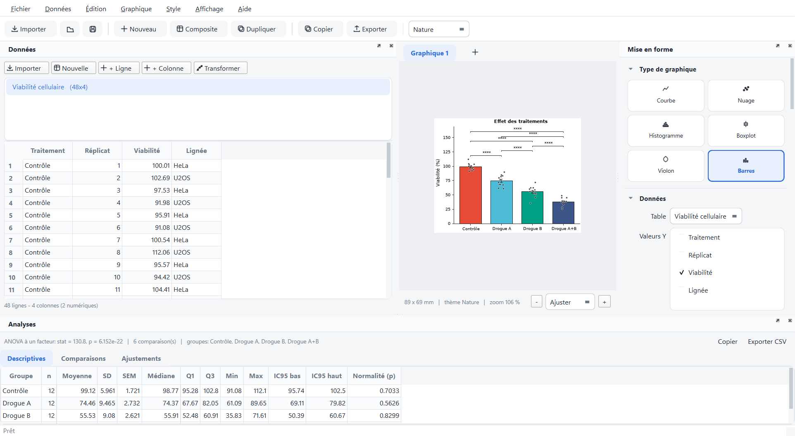
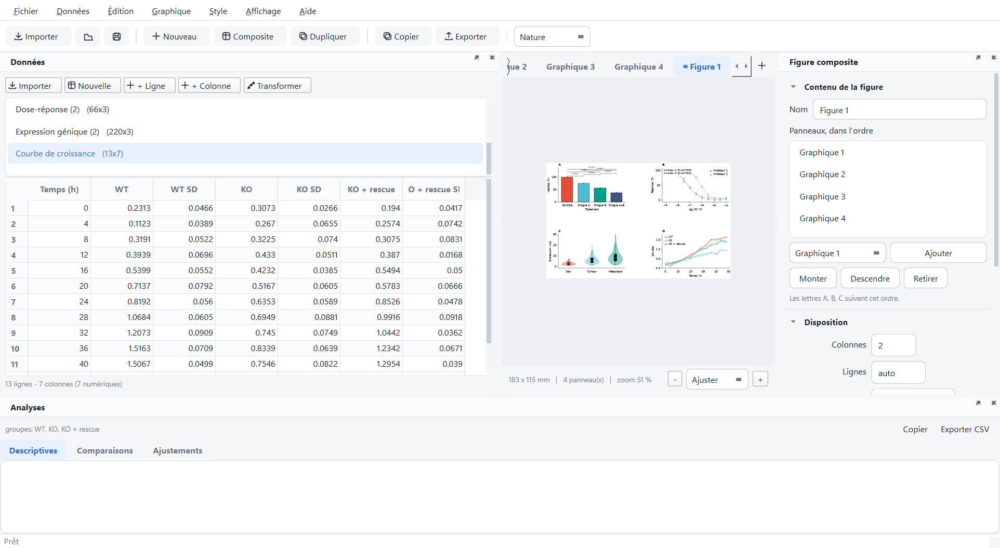

# Plotea

Figures scientifiques de qualité publication, libres et gratuites — une
alternative ouverte à GraphPad Prism. Interface PyQt6, moteur matplotlib,
statistiques SciPy. Fonctionne sous **Linux, macOS et Windows**.





---

## Ce que fait Plotea

| | |
|---|---|
| **Import** | CSV, TSV, TXT (séparateur et décimale détectés), Excel `.xlsx` / `.xlsm` / `.xls` multi-feuilles, collage depuis Excel |
| **Types de graphiques** | courbes, nuages de points, histogrammes, boxplots, violin plots, barres avec erreurs (simples et groupées à deux facteurs) |
| **Thématiques** | Nature, Science, Cell, PNAS, Minimal, Grayscale — typographie, largeur de colonne et palette conformes aux instructions aux auteurs |
| **Export** | SVG, PDF, EPS (vectoriels, texte éditable) · PNG, TIFF, JPEG jusqu'à 1200 dpi (600 dpi par défaut) |
| **Statistiques** | t de Student / Welch / apparié, Mann-Whitney, Wilcoxon, ANOVA + Tukey, Kruskal-Wallis ; corrections Bonferroni / Holm / FDR ; barres de significativité automatiques, y compris sur les barres groupées à deux facteurs |
| **Ajustements** | linéaire, polynomial, exponentiel, logarithmique, puissance, Michaelis-Menten, Hill 4PL (dose-réponse), gaussienne, sigmoïde — avec R², erreurs types et bande de confiance 95 % |
| **Figures composites** | plusieurs graphiques sur une même figure, grille au choix, lettres A/B/C automatiques, axes partageables |
| **Transformations** | % du contrôle, normalisation 0-100, log10 / ln / log2, score z, soustraction de la ligne de base, rapport à une colonne, moyenne des réplicats |
| **Projets** | fichiers `.plotea` contenant données + graphiques + figures composites, annuler/rétablir, styles réutilisables, export en lot |

### Au-delà de Prism

- **Gratuit et sans licence**, code MIT, aucune activation.
- **Choix automatique du test** (Shapiro pour la normalité, Levene pour
  l'égalité des variances) avec possibilité de forcer le test.
- **Bande de confiance 95 %** sur les ajustements non linéaires, calculée par
  la méthode delta.
- **Aperçu à la taille physique réelle** : la figure est affichée en
  millimètres, à la largeur de colonne du journal visé.
- **SVG/PDF à texte éditable** (`svg.fonttype: none`, `pdf.fonttype: 42`) :
  les étiquettes restent modifiables dans Illustrator ou Inkscape.
- **Mode monochrome** (hachures + palette de gris) pour l'impression N&B.
- **Thème sombre** pour l'interface, la figure restant toujours sur fond blanc.
- **Interface entièrement en français**, accents compris, y compris les
  dialogues standards de Qt : le message de fermeture propose « Enregistrer /
  Quitter sans enregistrer / Annuler », pas « Save / Discard / Cancel ».
- **Un seul test statistique par figure** : les hypothèses sont vérifiées une
  fois sur tous les groupes, plutôt qu'au cas par cas, ce qui évite de mélanger
  Student et Mann-Whitney dans la même légende.
- **Annuler / rétablir** sur les données comme sur la mise en forme, avec
  regroupement des retouches rapides en une seule étape.
- **Gros jeux de données** : au-delà de quelques milliers de points les
  séries sont rastérisées dans les sorties vectorielles et le nuage de points
  individuels est plafonné à l'affichage — les statistiques, elles, utilisent
  toujours toutes les valeurs. Un nuage de 120 000 points se rend en 0,2 s.
- **Journal des erreurs** consultable (**Aide ▸ Journal des erreurs**) : ce que
  le moteur rattrape pour ne pas fermer la fenêtre y est conservé avec sa trace
  complète, et écrit dans un fichier réutilisable pour un rapport de bug.
- **La session se souvient** : taille de la fenêtre, disposition des panneaux,
  thème clair ou sombre et dernier dossier utilisé sont retrouvés au
  lancement suivant. **Affichage ▸ Réinitialiser la disposition** rattrape un
  panneau égaré.

---

## Installation

### Application autonome (recommandé)

Aucun Python à installer : téléchargez l'archive de votre système,
décompressez-la, lancez `Plotea`. Tout est inclus — l'interpréteur, Qt et la
pile scientifique.

Pour la construire vous-même :

```bash
pip install pyinstaller
python tools/build_app.py
```

Le résultat est dans `dist/` : un dossier `Plotea` sur Windows et Linux, un
`Plotea.app` sur macOS. Sous Linux, un fichier `plotea.desktop` est également
écrit, à installer avec
`desktop-file-install --dir=~/.local/share/applications dist/plotea.desktop`.

Le fichier [plotea.spec](plotea.spec) pilote la construction ; il exclut les
modules Qt inutilisés (WebEngine, QML, Multimedia…), ce qui divise à peu près
par deux la taille du paquet.

### Depuis les sources

Python 3.10 ou plus récent est requis.

```bash
git clone <votre-depot> plotea
cd plotea
python -m venv .venv
```

Activez l'environnement :

```bash
source .venv/bin/activate
```

```powershell
.venv\Scripts\Activate.ps1
```

Puis installez et lancez :

```bash
pip install -e .
plotea
```

Sans installation, depuis le dossier du projet :

```bash
pip install -r requirements.txt
python -m plotea
```

### Notes par système

- **Linux** — installez aussi les bibliothèques système de Qt si elles
  manquent : `sudo apt install libxcb-cursor0 libxkbcommon-x11-0` (Debian /
  Ubuntu). Les polices Helvetica/Arial sont remplacées automatiquement par
  Nimbus Sans ou Liberation Sans ; pour un rendu identique aux revues,
  installez `fonts-liberation`.
- **macOS** — rien de particulier ; Helvetica est présente nativement, donc
  les thématiques Nature / Science / PNAS rendent leur typographie exacte.
- **Windows** — Arial est utilisée à la place de Helvetica (métriques
  identiques). **Évitez les chemins très longs** : les DLL de Qt échouent à se
  charger au-delà de la limite Windows. Placez l'environnement virtuel dans un
  chemin court, par exemple `C:\venvs\plotea`.

---

## Prise en main

1. **Fichier ▸ Jeux de données d'exemple** charge un jeu prêt à tracer, ou
   **Importer des données** (`Ctrl+O`) ouvre un CSV/Excel avec aperçu.
2. Dans le panneau **Mise en forme** à droite, choisissez le type de
   graphique, puis la colonne d'axe X, les colonnes de valeurs Y, et
   éventuellement une colonne de regroupement.
3. Choisissez la **thématique** de journal dans la barre d'outils.
4. Activez **Statistiques ▸ Comparaisons et annotations** pour obtenir les
   tests et les barres de significativité.
5. **Exporter la figure** : les boutons **Copier (PNG)** et **Exporter la
   figure…** sont juste sous l'aperçu, à droite des commandes de zoom. SVG ou
   PDF pour une soumission, PNG 600 dpi pour un document. Raccourcis `Ctrl+E`
   et `Ctrl+Maj+C`.

### Deux formats de données

**Format long** (recommandé) — une colonne décrit le groupe, une autre la
valeur. Choisissez la colonne dans « Grouper par » :

| Traitement | Viabilite |
|---|---|
| Controle | 100.01 |
| Controle | 102.69 |
| Drogue A | 82.14 |

**Format large** — une colonne par groupe. Cochez plusieurs colonnes dans
« Valeurs Y » :

| Sain | Tumeur | Metastase |
|---|---|---|
| 7.11 | 14.99 | 4.01 |
| 11.94 | 11.09 | 12.35 |

Pour des courbes avec des écarts-types déjà calculés, cochez les colonnes
correspondantes dans **Colonnes d'erreur**, dans le même ordre que les
séries Y.

### Tests appariés

Un test apparié compare deux mesures du **même** sujet. Plotea a donc besoin
de savoir qui est qui :

- **Format long** — renseignez la colonne **Appariement** (sujet, patient,
  réplicat) dans la section Statistiques. Sans elle, Plotea refuse de calculer
  plutôt que de comparer des observations sans rapport.
- **Format large** — la ligne du tableau tient lieu d'appariement : la ligne 3
  de « Avant » et la ligne 3 de « Après » sont le même sujet.

Un sujet dont une des deux mesures manque est écarté de la comparaison ;
l'appariement des autres n'est pas décalé pour autant.

### Transformations

**Données ▸ Transformer** (`Ctrl+M`) dérive une nouvelle table sans jamais
modifier l'originale : pourcentage du contrôle, normalisation de 0 à 100,
logarithmes, score z, soustraction de la ligne de base, rapport à une colonne
de référence, ou moyenne des réplicats avec SD, SEM et n. L'aperçu montre le
résultat avant validation, et la table produite s'appelle
`<source> [transformation]`.

### Figures composites

**Graphique ▸ Nouvelle figure composite** (`Ctrl+Maj+T`) crée un onglet qui
assemble plusieurs graphiques sur une seule figure : grille au choix, lettres
A/B/C dans l'ordre des panneaux, axes X ou Y partageables. Chaque panneau garde
sa propre thématique, donc une courbe dose-réponse en style Nature peut côtoyer
un histogramme en style Cell. L'export vaut pour la figure entière.

### Annuler / rétablir

`Ctrl+Z` et `Ctrl+Y` couvrent l'édition des données, la mise en forme, la
création et la suppression de graphiques, les transformations et les figures
composites. Une série de retouches rapprochées compte pour une seule étape,
comme dans un éditeur de texte.

### Plans à deux facteurs

Avec une colonne **Grouper par** et une colonne **Sous-groupe**, Plotea compare
les sous-groupes *à l'intérieur de chaque catégorie* (par exemple WT contre
Mutant à 0 h, puis à 6 h, puis à 24 h) et place les barres de significativité
au-dessus des paires concernées. Le tableau descriptif détaille les cellules
« catégorie / sous-groupe ».

L'onglet **ANOVA 2 facteurs** du panneau Analyses donne l'effet de chaque
facteur et leur interaction, avec sommes des carrés de type III — celles qui
conviennent aux plans déséquilibrés — F, p et eta² partiel.

### Raccourcis

| | |
|---|---|
| `Ctrl+O` | Importer des données |
| `Ctrl+S` | Enregistrer le projet |
| `Ctrl+E` | Exporter la figure |
| `Ctrl+T` | Nouveau graphique |
| `Ctrl+D` | Dupliquer le graphique |
| `F2` | Renommer le graphique |
| `Ctrl+Maj+C` | Copier la figure en PNG |
| `Ctrl+C` / `Ctrl+V` | Copier / coller dans le tableur |
| `Suppr` | Effacer les cellules sélectionnées |

---

## Utiliser le moteur sans interface

Tout le rendu est indépendant de Qt, donc scriptable :

```python
from matplotlib.figure import Figure
from plotea.core import demo, export, plotting
from plotea.core.plotspec import PlotSpec
from plotea.core.themes import get_theme

data = demo.viability()
spec = PlotSpec(plot_type="bar", group="Traitement", y=["Viabilite"],
                theme="Nature", ylabel="Viabilité (%)", stats_enabled=True)

figure = Figure(figsize=get_theme(spec.theme).figsize("single"))
info = plotting.render(figure, spec, data.df)

for comparison in info.comparisons:
    print(comparison.a, "vs", comparison.b, comparison.stars)

export.save_figure(figure, export.ExportOptions("figure.png", "PNG (raster)",
                                                dpi=600))
```

---

## Architecture

```
plotea/
  core/            moteur, sans aucune dépendance à Qt
    dataset.py     import CSV/Excel, nettoyage, remise en forme
    themes.py      thématiques de journaux (rcParams + palettes)
    plotspec.py    description sérialisable d'une figure
    plotting.py    rendu matplotlib de chaque type de graphique
    stats.py       tests, corrections de multiplicité, formatage des p
    fitting.py     modèles d'ajustement et bandes de confiance
    export.py      écriture SVG / PDF / EPS / PNG / TIFF
    project.py     format .plotea, styles enregistrés
    panel.py       figures composites et lettrage
    transforms.py  normalisation, logarithmes, % du contrôle...
    history.py     pile d'annulation par instantanés
    enums.py       clés machine et libellés affichés
    diagnostics.py journal des erreurs
    demo.py        jeux de données synthétiques
  resources/       icône de l'application, dessinée en code
  ui/              interface PyQt6
    main_window.py assemblage, menus, actions
    data_view.py   tableur éditable
    canvas.py      aperçu à la taille réelle
    inspector.py   panneau de mise en forme
    panel_editor.py editeur de figure composite
    stats_view.py  tables de résultats
    dialogs.py     import / export / à propos
    style.py       feuille de style Qt (clair et sombre)
    widgets.py     icônes vectorielles et widgets réutilisables
```

`tools/make_icons.py` régénère `plotea.png` et `plotea.ico` à partir du dessin
vectoriel de `plotea/resources`, pour que la barre des tâches et le raccourci
du bureau ne divergent jamais.

### Langue et compatibilité des fichiers

Les options sont stockées sous forme de **clés** (`sem`, `holm`, `hill4_log`),
jamais avec leur libellé français. Traduire l'interface plus tard ne cassera
donc aucun fichier enregistré aujourd'hui. À la lecture, une clé, un libellé
actuel ou un libellé d'une version antérieure sont tous acceptés : les anciens
projets migrent à l'ouverture, sans étape de conversion.

Le format `.plotea` est une archive zip : `project.json` (métadonnées et
graphiques) plus un CSV par table. Un projet reste donc lisible même sans
Plotea.

---

## Tests

```bash
pip install -e ".[dev]"
pytest                      # 146 tests, environ 2 minutes
pytest tests/test_anova.py  # une seule suite
pytest -k appariement       # un seul sujet
```

| Suite | Couvre |
|---|---|
| `test_engine.py` | rendu des 6 types, 6 thématiques, ajustements, tous les formats d'export |
| `test_import.py` | CSV européens, séparateurs, encodages, classeurs Excel |
| `test_stats_fixes.py` | barres groupées, tests appariés, valeurs manquantes |
| `test_anova.py` | ANOVA à deux facteurs, choix de test par famille |
| `test_transforms.py` | les neuf transformations et leur dialogue |
| `test_history.py` | annuler / rétablir |
| `test_panels.py` | figures composites, lettrage, persistance |
| `test_session.py` | icône, disposition mémorisée, points d'entrée |
| `test_debt.py` | clés vs libellés, journal d'erreurs, gros volumes |
| `test_feedback.py` | retours d'utilisation : bascule des types, accès à l'export, langue |
| `test_gui.py` | interface complète, bout en bout |

Les tests tournent hors écran (`QT_QPA_PLATFORM=offscreen`) et sans afficheur
matplotlib, donc ils passent en intégration continue. Le workflow
[.github/workflows/tests.yml](.github/workflows/tests.yml) les exécute sur
Linux, macOS et Windows, en Python 3.11 et 3.13, et sait aussi construire les
binaires autonomes des trois systèmes à la demande.

`test_stats_fixes.py` et `test_anova.py` comparent les p et les sommes des
carres produits par l'application a des calculs faits a la main, et verifient
que l'appariement resiste aux valeurs manquantes et a l'ordre des lignes.
Les sorties visuelles sont ecrites dans `tests/_out/`.

---

## Licence

MIT — voir [LICENSE](LICENSE). Plotea n'est affilié ni à GraphPad, ni aux
revues dont les styles sont imités.
